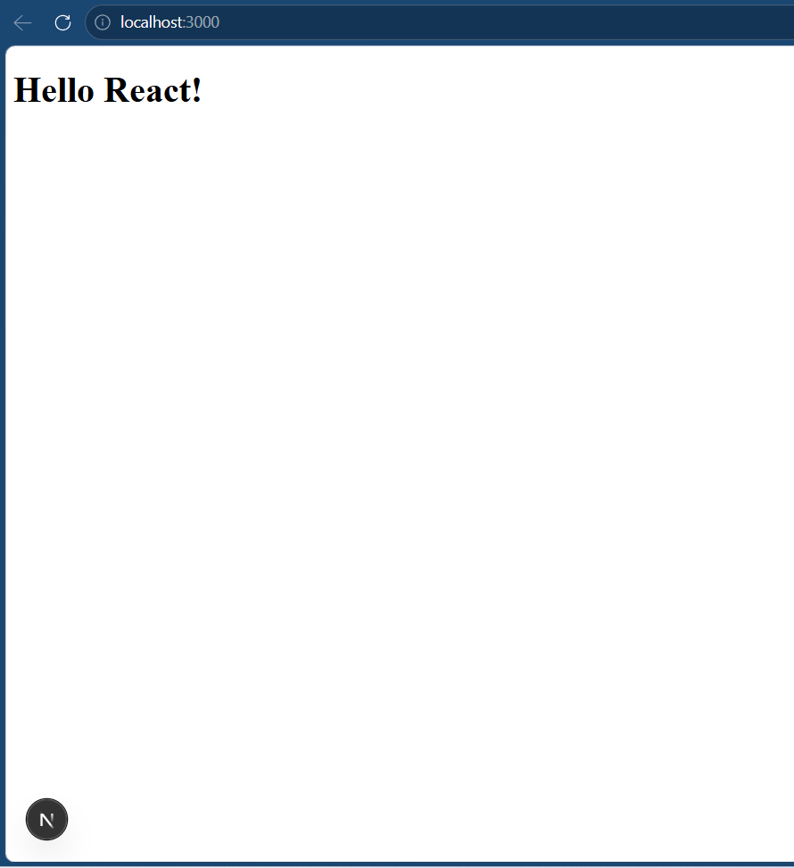
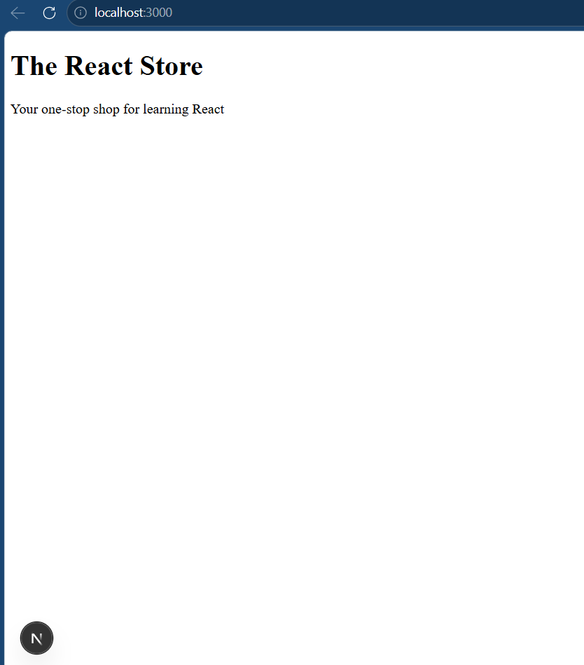
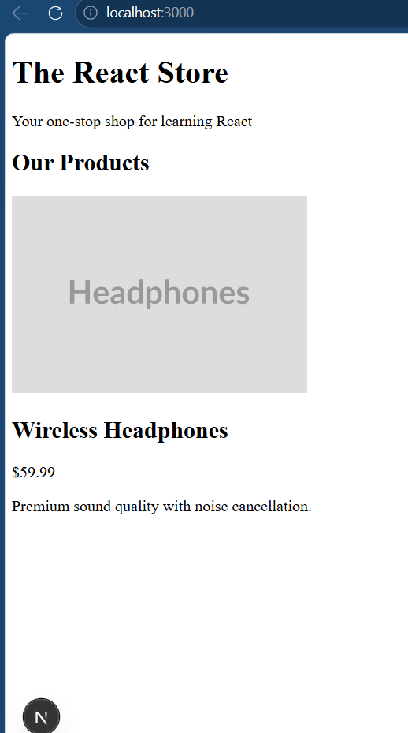
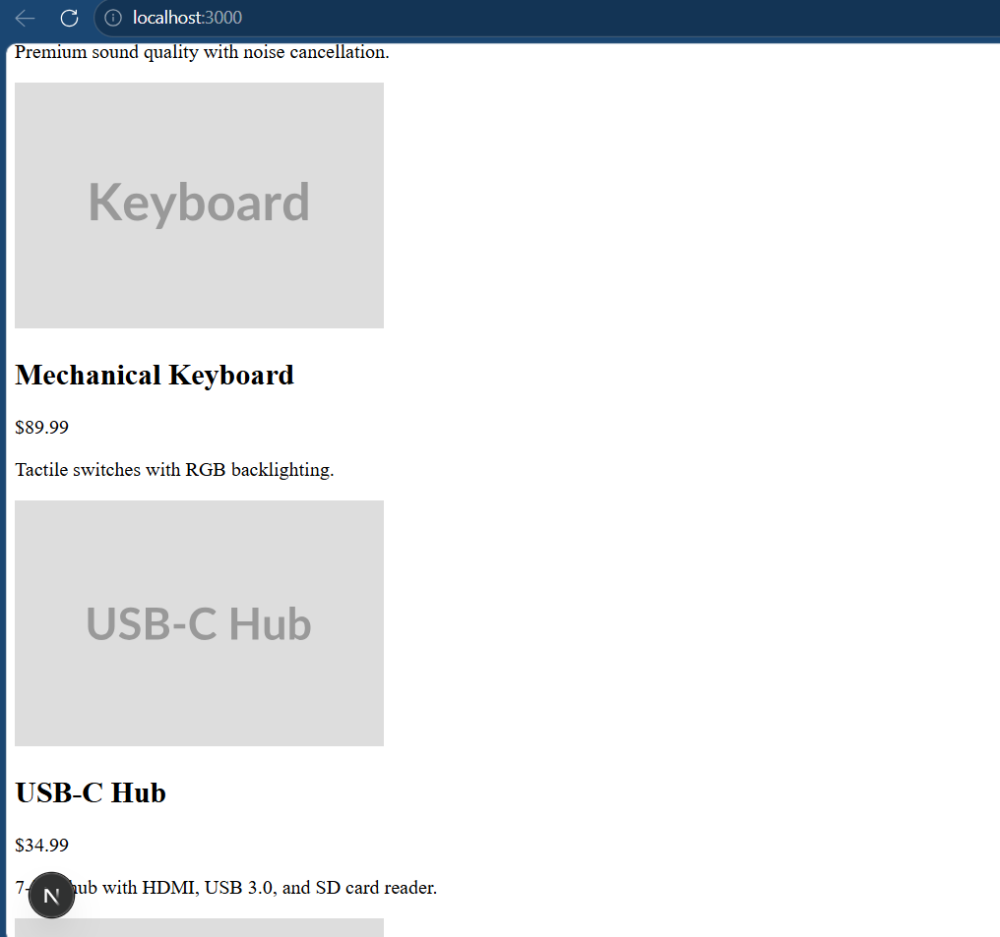
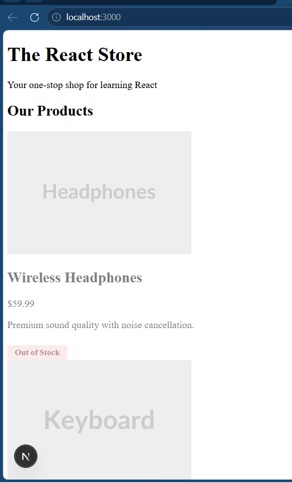
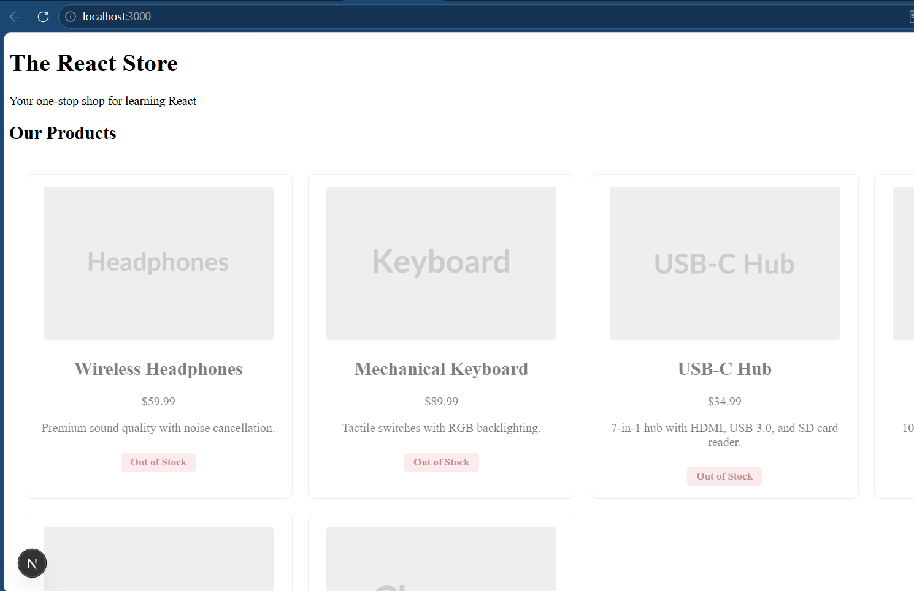

# Hello React with Next.js

A simple online store page built with React and Next.js. The project demonstrates reusable components, props, list rendering with `.map()`, and conditional rendering for product availability. Screenshots of the application are included below.

Below you can see the verification steps for iterations:

## Screenshots

Hello React

The React Store

Bonus

